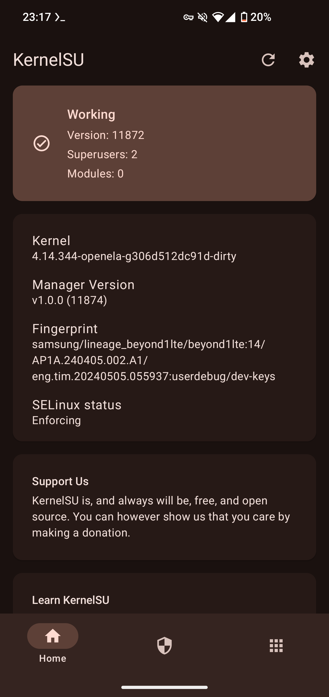

# KernelSU for Galaxy S10/Note10 series

## ⚠️ Warning

The max version for KSU for non-GKI kernels (the S10's)
is 0.9.5, which is out-of-date. Please do not bug the
creator of KSU or any other KSU contributors/devs with
bugs asking why X, Y & Z don't work.

## Compatibility

This is built from LineageOS 21 (Linux4's build) but may
be compatible with other ROMS. If you want to test it,
make sure to make a backup of your current bootimg in
case something goes wrong.

If you find success with another ROM, you can create an
issue with the 'enhancement' label, providing your device
name & model, your ROM & its version and it will be added
to the list below.

Tested:

✅ Samsung Galaxy S10 (Exynos)/beyond1lte, LineageOS 21.0

##  Known bugs/issues (to-do)

See [TO-DO.md](https://github.com/alemontn/ksu-beyond1/blob/main/TO-DO.md)

The to-do list is sorted by highest priority to lowest

Once an issue is resolved/a feature implemented, it will be moved to
[DONE.md](https://github.com/alemontn/ksu-beyond1/blob/main/DONE.md)

##  How to install (Linux only)

1)  Get the bootimg for your device

    This can be done by either extracting it from
    recovery/fastboot or downloading it from your
    ROM's sideload ZIP file

2)  Compile & install 'magiskboot'

    Here are some rough guidelines on how:

    * Install the Android SDK & export it as
      `ANDROID_SDK_ROOT`

    * Clone 'topjohnwu/Magisk' with submodules

    * Get the NDK (`./build.py ndk`)

    * Compile standalone magiskboot (`./build.py binary magiskboot`)

    * Install (`sudo install -m755 ./native/out/<ARCH>/magiskboot /usr/bin/magiskboot`)

3)  Extract your device's boot image & remove the current kernel:

    `magiskboot unpack boot.img`

    `rm kernel`

4)  Download the patched kernel from releases

5)  Decompress it:

    `gunzip Image.gz`

    `mv Image kernel`

6)  Repack the boot image:

    `magiskboot repack boot.img`

7)  Flash the boot image:

    `adb reboot download`

    `heimdall flash --BOOT boot.img`

8)  Install the KernelSU manager
